# ela.js E-Learning App Framework

ela.js is a JavaScript framework and build environment for developing
HTML5 E-Learning Apps.

Sorry, a comprehensive readme is currently only
available [in German](README.de.md).

## Installation

Add this line to your application's Gemfile:

```ruby
gem 'ela.js', require: 'ela'
```

And then execute:

    $ bundle

Or install it yourself as:

    $ gem install ela.js

## Usage

	$ mkdir my-apps
	$ cd my-apps
	$ ela init
	$ ela serve

## Screenshots

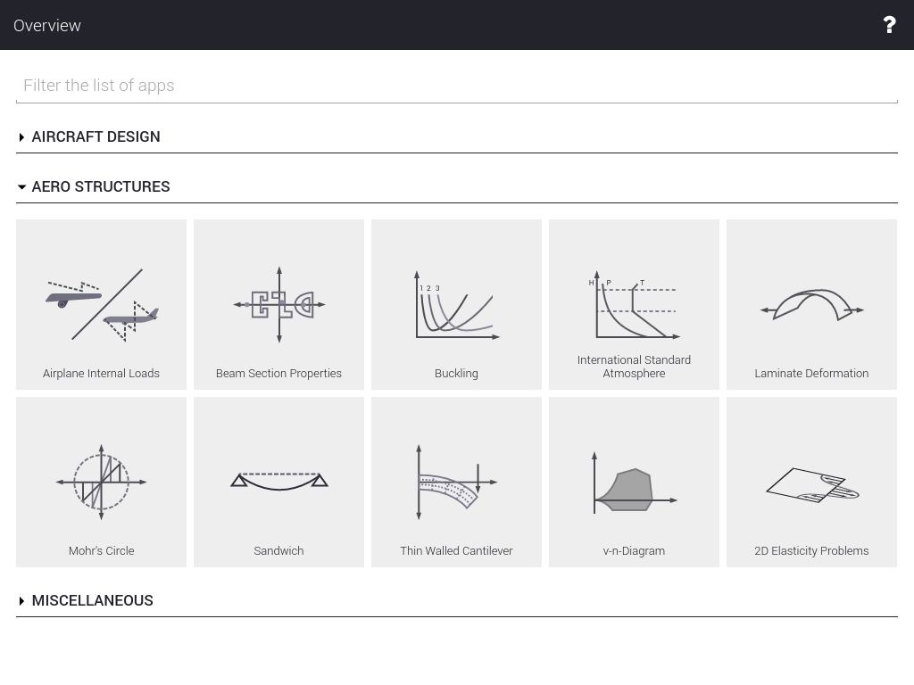

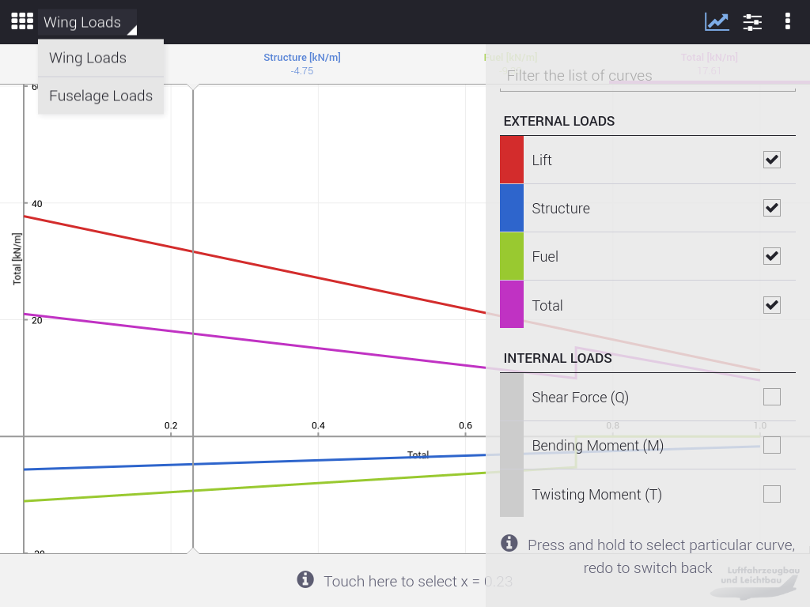

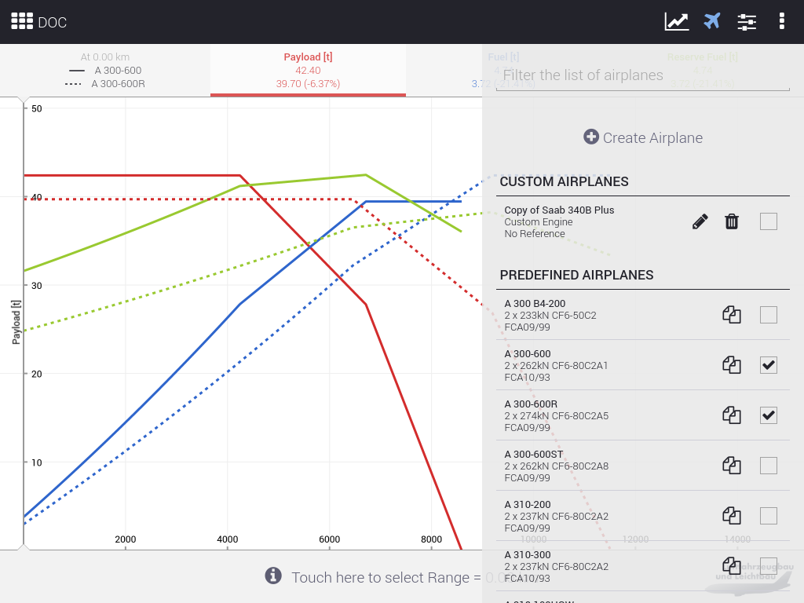

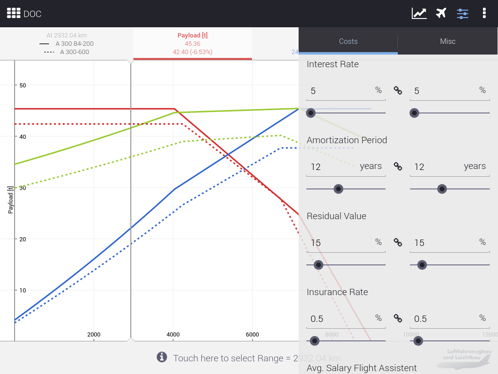

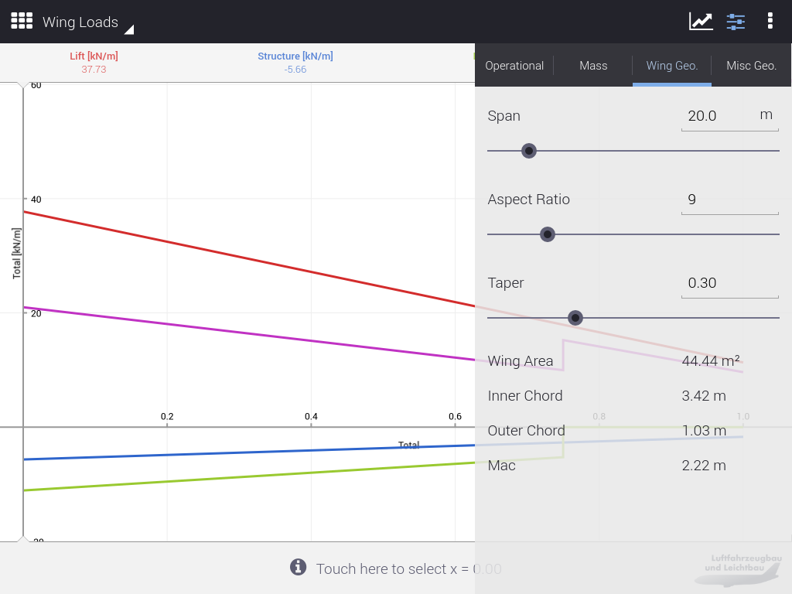

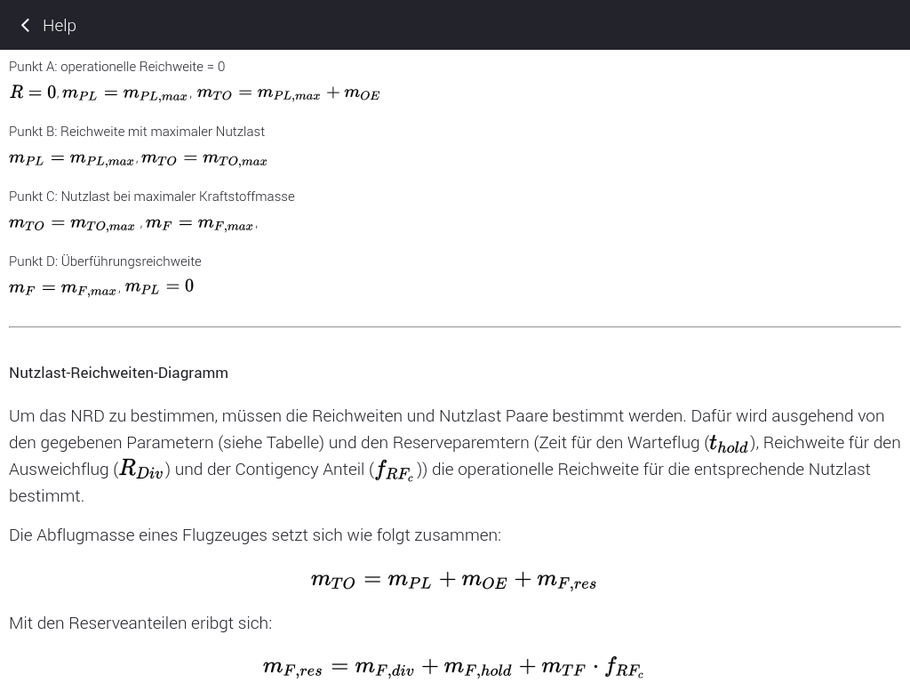

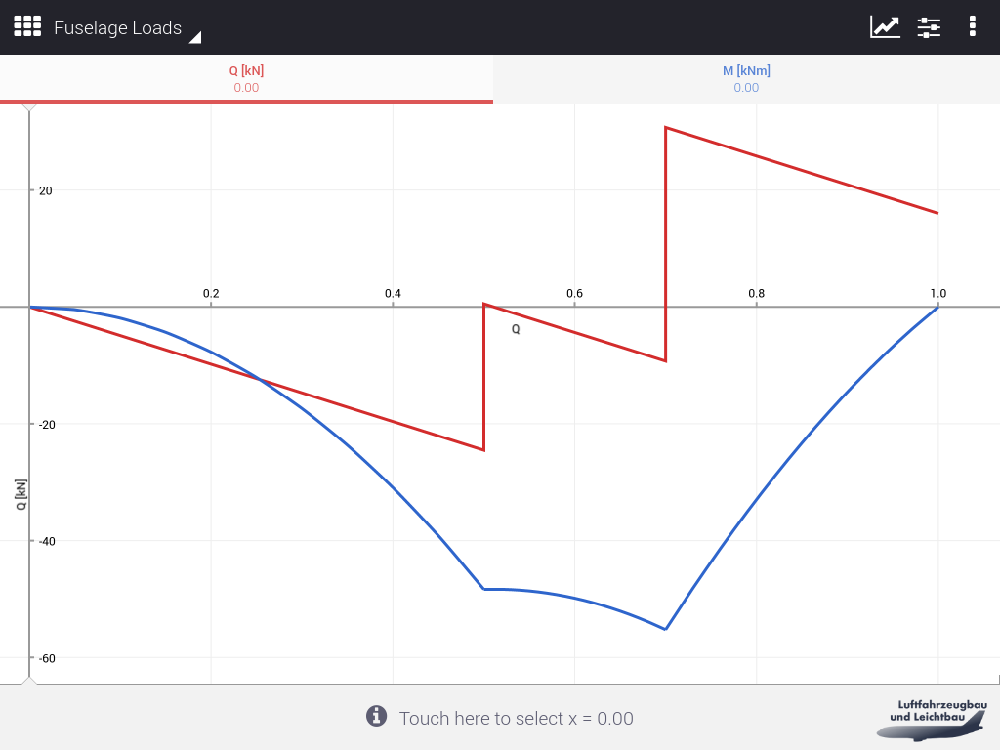

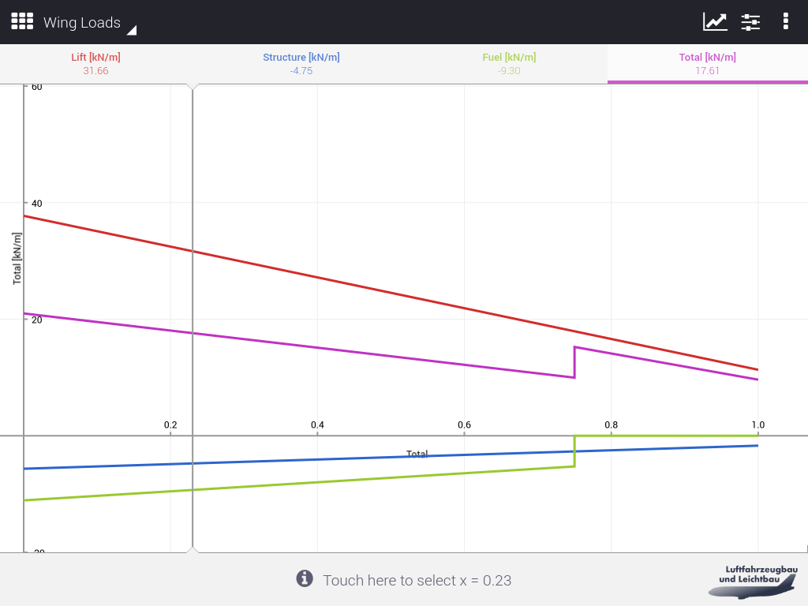

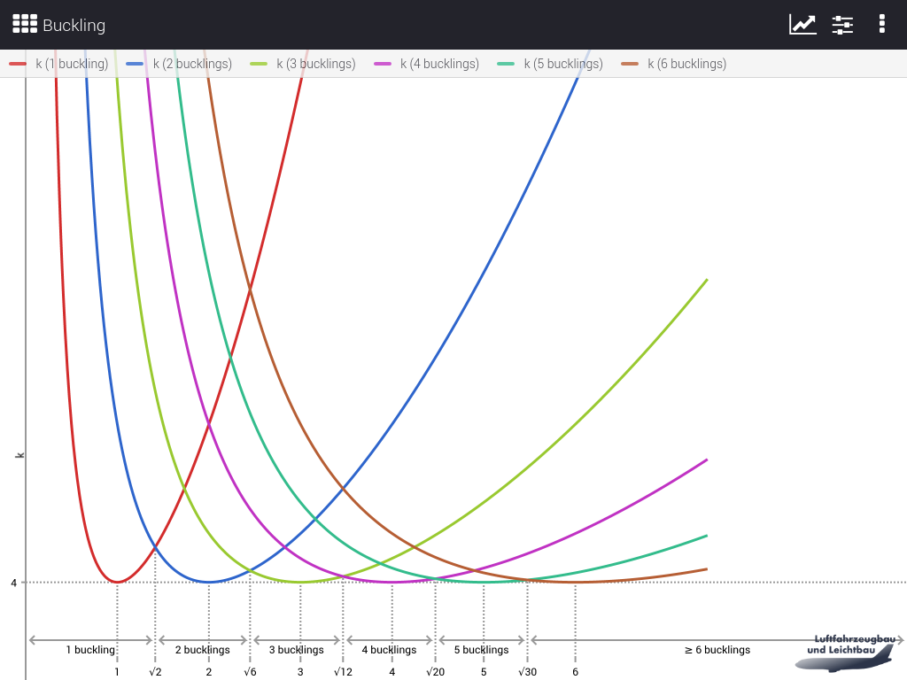

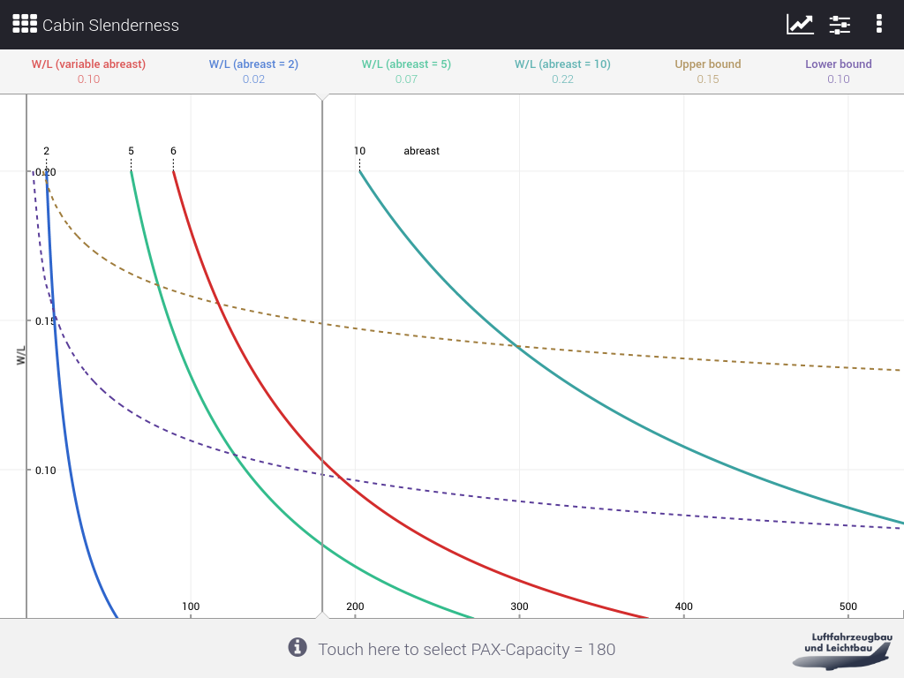

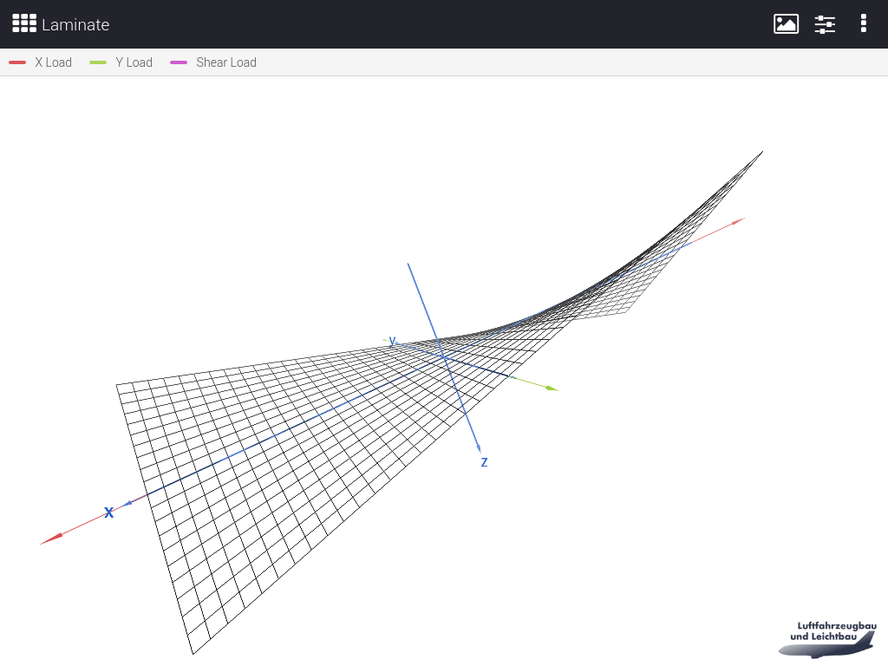

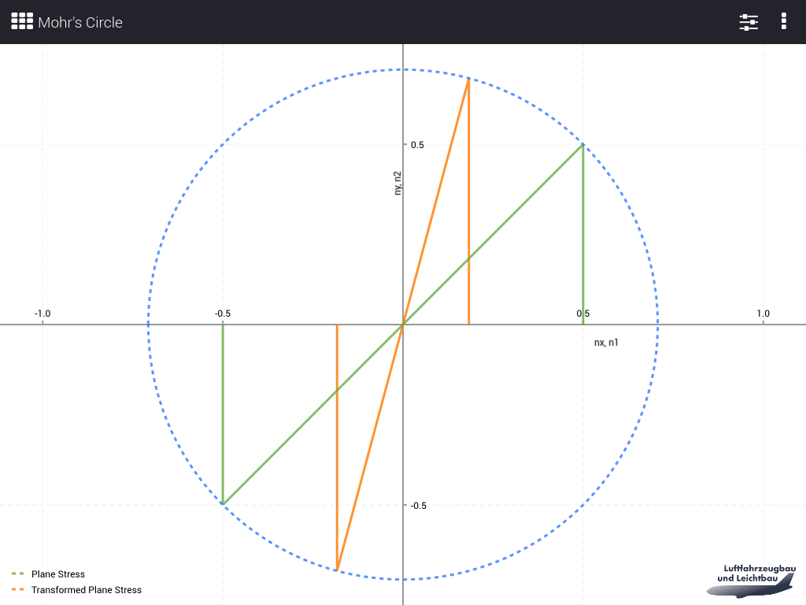

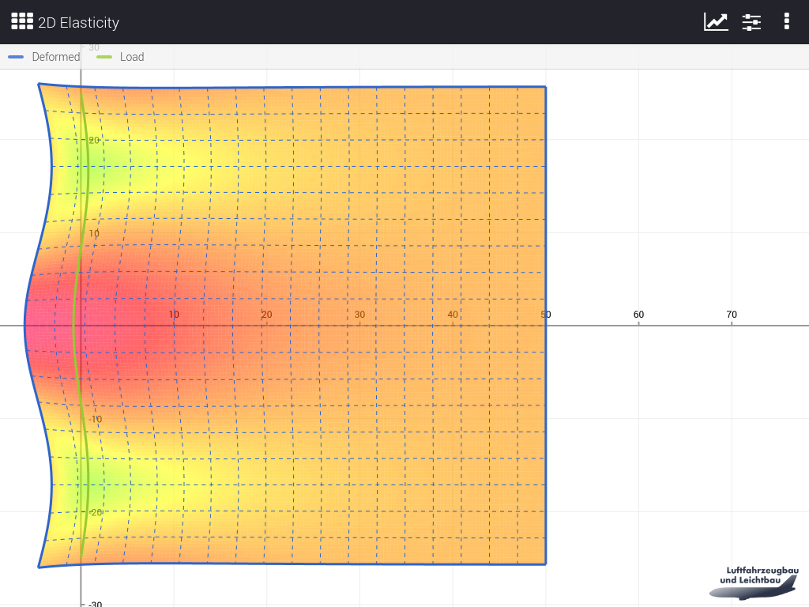

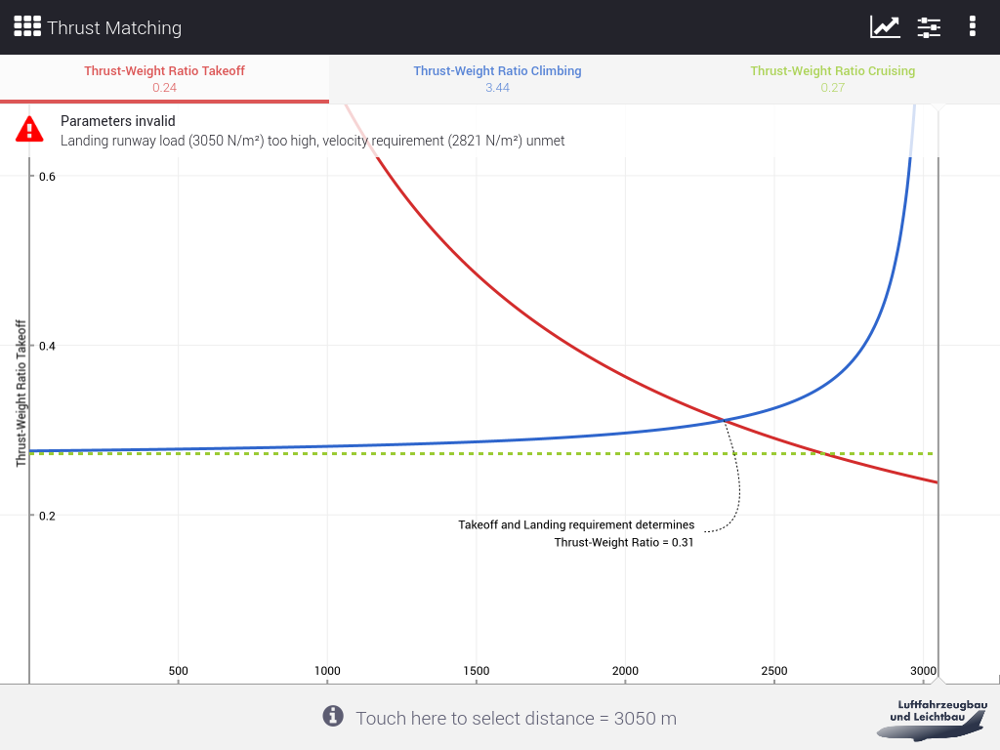

## Credits

This framework was initially written to support teaching at the
department of aircraft construction, institute of aerospace at the
Berlin Institute of Technology ("Technische Universität Berlin").
